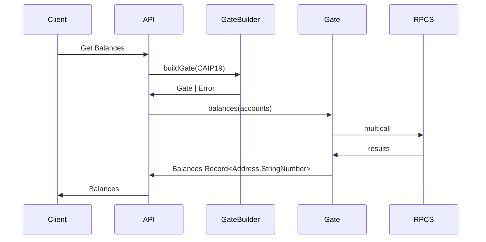

# Hypergate

## Development

You will need bun to run the project. [Learn more](https://bun.sh/)

```bash
# Linux / macOS
curl -fsSL https://bun.sh/install | bash

# Windows
powershell -c "irm bun.sh/install.ps1 | iex"
```

Once bun is installed, make sure you install deps

```bash
bun i
```

Then run it

```bash
bun dev
```

Running tests

```bash
bun test
```

Open http://localhost:3000/ with your browser to see the result.

## Usage

```bash
curl -XPOST 0:3000/api/balances -H'content-type: application/json' -d @- << EOF
{
  "asset": "eip155:1/erc20:0xa0b86991c6218b36c1d19d4a2e9eb0ce3606eb48",
  "accounts": [
    "0xb6f6Dce6000cA88cC936B450cEDB16a5c15f157f",
    "0xF1f8CAC358a4c86979AFF1bD380498206E8224B6",
    "0xdead000000000dead0000000beef000000000000"
  ]
}
EOF
```

### Example Sequence

Get asset balances for a given set of accounts

